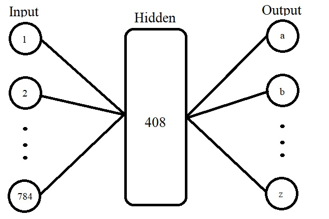
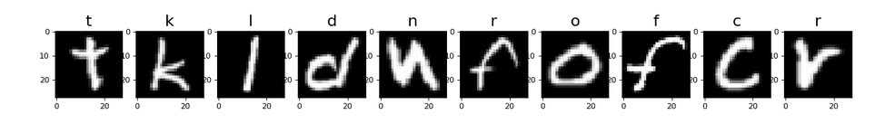

# Emnist letter predictor

## Overview  
This is a notebook containing a simple neural network that was trained on the Emnist letter dataset.

Drawing of neural net structure  

## Usage  
Given a 28x28 image of a letter the program can with 88.673% ± 0.384% accuracy guess the letter.

## Functionality  
The neural network was built using the PyTorch framework. It has one hidden layer of size 500, uses leakyReLu as its activation fuction,
and stochastic gradient descent (SGD) as its optimizer. The loss function is CrossEntropyLoss and the guess was made using softmax. The code can be used with GPU and CPU. With a Google colaboratory account you can borrow a GPU for training, which reduces the time it takes with about 27% depending on the number of epochs.  

## Source:  
Cohen, G., Afshar, S., Tapson, J., & van Schaik, A. (2017). EMNIST: an extension of MNIST to handwritten letters. Retrieved from http://arxiv.org/abs/1702.05373
